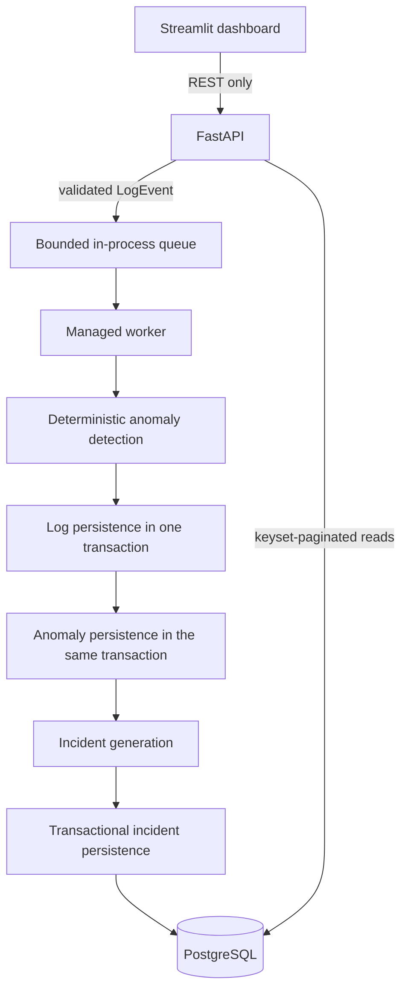

# SentinelStream

[](https://github.com/FawazDev-cmd/sentinelstream/actions/workflows/ci.yml)


**SentinelStream turns structured application logs into deterministic anomaly evidence and grouped incidents through an asynchronous, observable processing pipeline.**

A FastAPI endpoint validates each log and accepts it into a bounded in-process queue. A
managed worker applies deterministic anomaly rules, atomically stores the event and findings,
and generates stable incidents in PostgreSQL. Cursor-paginated APIs expose the persisted
results, while a separate Streamlit application provides a recruiter-friendly demo using
only those public REST endpoints.

## Why SentinelStream

Production logs are difficult to inspect manually, and isolated failures rarely provide
enough context on their own. SentinelStream demonstrates how strict event contracts,
explainable rule evidence, deterministic temporal grouping, and safe read interfaces can
turn related operational signals into incidents without hiding decisions behind an LLM.

## Key features

### Log processing

- Structured JSON ingestion with strict Pydantic validation and normalization
- Bounded non-durable `asyncio` queue with explicit backpressure behavior
- Managed worker startup, draining, cancellation, and shutdown
- Asynchronous SQLAlchemy 2.x and asyncpg persistence to PostgreSQL
- Explicit Alembic migrations; application startup never mutates the schema

### Intelligence

- Versioned deterministic rules for error levels, server errors, exceptions, and latency
- Safe anomaly evidence that excludes message contents and metadata
- Rolling source-event-time lookback for runtime incident generation
- Five-minute adjacent-gap grouping with an inclusive boundary
- Deterministic UUIDv5 incident identities and ordered finding memberships
- Database-enforced uniqueness for finding assignment

### Query and demo

- Opaque keyset cursor pagination for logs, anomalies, and incidents
- Exact filters and inclusive time boundaries exposed by the existing APIs
- Incident list and detail reads with ordered findings
- Six-page Streamlit dashboard: Overview, Logs, Anomalies, Incidents, Demo, and About
- Demo ingestion form that submits the existing log API contract

### Engineering quality

- Clean Architecture with a framework-independent domain
- Structured JSON processing and worker lifecycle logs with correlation IDs
- Monotonic processing-duration measurement and safe failure classification
- Non-root Docker images and health-aware Docker Compose services
- GitHub Actions gates for quality, PostgreSQL integration, migrations, and image builds
- pytest, Ruff, strict mypy, and locked dependency management with uv

## Architecture



Streamlit never connects to PostgreSQL. Presentation and infrastructure depend on
application contracts, while the domain remains independent of FastAPI, Streamlit,
SQLAlchemy, queues, and logging frameworks.

## Runtime flow

1. `POST /api/v1/logs` validates and normalizes a timezone-aware structured log.
2. The ingestion service constructs a trusted `LogEvent` and attempts non-blocking queue
   insertion.
3. The API returns HTTP 202 only after queue acceptance. This does **not** mean the event
   is durably persisted or fully processed.
4. The managed worker consumes the event asynchronously, and deterministic rules produce
   zero or more anomaly findings in stable order.
5. The source log and all findings are committed atomically in one transaction.
6. When findings exist, incident generation synchronously reads eligible findings within
   the configured source-event lookback and applies deterministic adjacent-gap grouping.
7. Qualifying incidents and ordered memberships are persisted, and structured lifecycle
   telemetry records the outcome. Failures propagate to the worker boundary without
   retries.

## Screenshots

Screenshot capture is intentionally deferred until representative demo data is loaded.
The following paths are reserved and easy to activate later without leaving broken image
links in this README:

| View | Expected path |
| --- | --- |
| Overview | `docs/screenshots/overview.png` |
| Logs | `docs/screenshots/logs.png` |
| Anomalies | `docs/screenshots/anomalies.png` |
| Incidents | `docs/screenshots/incidents.png` |
| Demo ingestion | `docs/screenshots/demo-ingestion.png` |
| Docker Compose | `docs/screenshots/docker-compose.png` |
| GitHub Actions | `docs/screenshots/github-actions.png` |

The directory is preserved by `docs/screenshots/.gitkeep`. No screenshot is claimed until
the corresponding file exists.

## Technology stack

| Area | Technologies |
| --- | --- |
| Runtime | Python 3.13, asyncio |
| API and validation | FastAPI, Pydantic |
| Persistence | PostgreSQL 17, SQLAlchemy 2.x, asyncpg, Alembic |
| Demo frontend | Streamlit, requests |
| Quality | pytest, Ruff, strict mypy |
| Delivery | uv, Docker, Docker Compose, GitHub Actions |

## Project structure

```text
app/
  domain/           # Immutable business values and incident candidates
  application/      # Contracts, use cases, rules, grouping, orchestration
  infrastructure/   # asyncio queue and PostgreSQL adapters
  presentation/     # FastAPI routes, schemas, and dependency wiring
  monitoring/       # Structured logging configuration
  shared/           # Validated runtime settings
streamlit_app/      # REST-only demonstration frontend
alembic/            # Versioned PostgreSQL migrations
tests/              # Unit, API, frontend, and guarded integration tests
docs/               # Recruiter demo guide and screenshot placeholders
.github/             # GitHub Actions CI
```

## Quick start

### Local Python

Requirements: Python 3.13, [uv](https://docs.astral.sh/uv/), and a reachable PostgreSQL
instance.

```bash
cp .env.example .env
uv sync --frozen
uv run alembic upgrade head
uv run uvicorn app.presentation.api.main:app --host 127.0.0.1 --port 8000
```

The Compose-oriented `.env.example` uses the hostname `postgres`. For a host-installed
PostgreSQL server, change `SENTINELSTREAM_DATABASE_URL` in `.env` to use `localhost`
before applying migrations. Keep the `postgresql+asyncpg://` scheme.

Start Streamlit in a second terminal:

```bash
uv run streamlit run streamlit_app/app.py
```

`STREAMLIT_BACKEND_URL` defaults to `http://127.0.0.1:8000`; override it when the API is
elsewhere. Open <http://localhost:8501>.

### Docker Compose

The actual services are `postgres`, `api`, and `dashboard`:

```bash
cp .env.example .env
docker compose build
docker compose up -d postgres
docker compose run --rm api uv run alembic upgrade head
docker compose up -d api dashboard
docker compose ps
```

Check API process health:

```bash
curl http://localhost:8000/health
```

Then open the dashboard at <http://localhost:8501>. Stop services without deleting data
using `docker compose down`. The destructive `docker compose down -v` additionally
removes the local PostgreSQL volume.

## API overview

FastAPI exposes interactive OpenAPI documentation at <http://localhost:8000/docs> and
<http://localhost:8000/redoc> with the default application configuration.

| Method | Endpoint | Purpose |
| --- | --- | --- |
| `GET` | `/health` | Report API process health, service name, and version; it is not a database probe. |
| `POST` | `/api/v1/logs` | Validate and enqueue one log; return HTTP 202 after queue placement. |
| `GET` | `/api/v1/logs` | Read persisted logs with exact filters and keyset pagination. |
| `GET` | `/api/v1/anomalies` | Read safe persisted anomaly findings with existing filters and keyset pagination. |
| `GET` | `/api/v1/incidents` | Read incident summaries with existing filters and keyset pagination. |
| `GET` | `/api/v1/incidents/{incident_id}` | Read one incident and its ordered findings. |

Example ingestion request:

```bash
curl -X POST http://localhost:8000/api/v1/logs \
  -H "Content-Type: application/json" \
  -d '{
    "timestamp": "2026-07-22T12:00:00Z",
    "service": "payments-api",
    "environment": "demo",
    "level": "error",
    "message": "Payment provider returned an error",
    "status_code": 503,
    "latency_ms": 1450,
    "metadata": {}
  }'
```

A successful response has status `202 Accepted` and contains `status: "accepted"` plus
the selected event UUID. There are no mutation endpoints for findings or incidents.

## Demo workflow

Follow [the recruiter demo guide](docs/demo.md) for the complete walkthrough:

1. Start PostgreSQL and apply the explicit migrations.
2. Start FastAPI and Streamlit.
3. Submit two related error logs through the Demo page.
4. Refresh Anomalies, then inspect the generated incident and ordered findings.
5. Review structured processing and worker lifecycle logs.

The dashboard does not poll continuously and does not bypass the API.

## Testing and quality

Latest locally verified baseline:

- **406 tests passed**
- **10 guarded PostgreSQL integration tests were collected but skipped locally** because
  `SENTINELSTREAM_TEST_DATABASE_URL` was not configured
- Ruff, formatting, and strict mypy passed

```bash
uv run pytest
uv run pytest -m "not integration"
uv run ruff check .
uv run ruff format --check .
uv run mypy app tests
```

PostgreSQL integration tests require a dedicated database whose name contains `test`.
GitHub Actions provisions `sentinelstream_test`, applies Alembic migrations, and runs the
integration marker separately. The local skipped tests are not described as locally
passing.

## Design decisions

- **Deterministic rules over LLM decisions:** findings are repeatable, versioned, and
  supported by bounded structured evidence. The MVP is intentionally LLM-free.
- **Bounded in-process queue:** sufficient for a single-process MVP and explicit about
  capacity, lifecycle, and non-durability without introducing a broker prematurely.
- **Keyset pagination:** stable ordering and cursor traversal avoid offset drift and
  increasingly expensive offsets.
- **Explicit Alembic migrations:** schema changes remain reviewable operator actions;
  startup performs no hidden DDL.
- **UUIDv5 incident identity:** identical grouping inputs produce the same incident
  identity and support idempotent persistence checks.
- **Streamlit as presentation only:** it demonstrates existing contracts without direct
  database access or duplicated rules.
- **PostgreSQL as system of record:** normalized logs, findings, incidents, constraints,
  and ordered memberships remain durable in one relational store.

## Current limitations

These are deliberate MVP boundaries rather than claims of production completeness:

- No authentication, authorization, user accounts, or multi-tenancy
- No durable broker, retries, replay workflow, or dead-letter queue
- No alerts, notifications, incident acknowledgement, assignment, or resolution
- No Prometheus, OpenTelemetry, tracing backend, or metrics endpoint
- No Kubernetes or cloud deployment configuration
- No LLM-generated findings or explanations

## Future work

Realistic extensions include durable queueing and replay, authenticated tenant-aware
access, incident workflow state, outbound notification adapters, and standards-based
metrics/tracing. Each would require an explicit reliability and security design rather
than being implied by the MVP.
